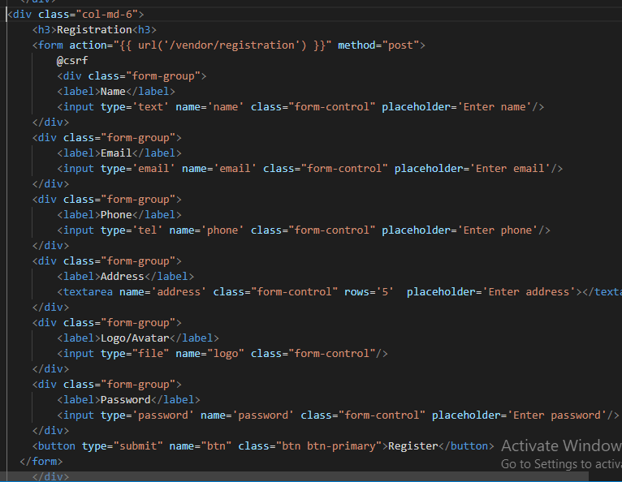

<!---MArkdown Tutorial---->
Shuaib Ahmed<br/>  
This is second line 

---

# Shuaib Ahmed
## Shuaib Ahmed
### Shuaib Ahmed
#### Shuaib Ahmed
###### Shuaib Ahmed
<p>This is Shuaib ahmed. I am 32 years old. My university is AUST</p>
<i>this is an italic text</i>  

_this is an italic text_

__this is a bold text__

<del>this is an italic text</del>

### StrikeThrough
~~this is an italic text~~

### Single line code   
`this is inline`  
`<h1> Bangladesh </h1>`


### Multiple Line Code
```
<html>
<head> </head>
<body> </body>
</html>
```
```javascript
console.log('hello')
```
```css
head{
    backgroud-color: green;
}
```

### Ordered List
1. item1
     1. item1
     2. item2
2. item3

### Unorder List
- item1
- item2

### List

- [x] Task1
- [] Task1

<br/>

### autometic link  

http://www.studywithanis.com

### disable link 

`http://www.studywithanis.com`

### markdown link syntax
[Studywithanis](http://www.studywithanis.com)

### markdown link syntax
[Studywithanis][websitelink
]
[facebook][facebooklink]


<!----all link is here-->
[websitelink]: http://www.studyithanis.com
[facebooklink]: http://anisfacebook.com 

### image syntax




😊 
### table syntax
 | Name  | Email  | 
  | ------ | ------  | 
   | Shoeb | Text  | 